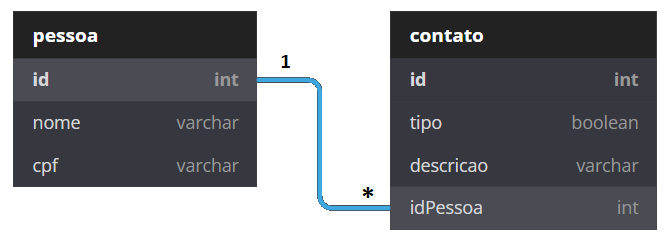

 

 
 

# Teste para vaga de Full Stack no Magazord.com.br
Este repositório tem como fim testar os candidatos para vaga de desenvolvedor Full Stack na empresa [Magazord](https://magazord.com.br).
> Para esta vaga buscamos alguém apaixonado por Node, Banco de Dados, APIs e que tenha facilidade em outras tecnologias e esteja sempre atento aos detalhes!

## O teste

Neste desafio você criará uma sistema para cadastro de pessoas e seus contatos

## Requisitos funcionais:

- RF01 - O sistema deve manter uma tela de consulta para pessoas.

- RF02 - O sistema deve manter um campo de pesquisa por nome de pessoa.

- RF03 - O sistema deve manter uma tela de consulta para contatos.

- RF04 - O sistema deve manter um CRUD (Cadastrar, Visualizar, Alterar, Excluir) para pessoas.

- RF05 - O sistema deve manter um CRUD (Cadastrar, Visualizar, Alterar, Excluir) para contato.

## Requisitos não funcionais:

- RNF01 - O sistema deve utilizar a linguagem NodeJS para o Back-end.

- RNF02 - Deve se utilizar ReactJS para a parte visual.

- RNF03 - O sistema deve ser responsivo.

- RNF04 - O sistema deve se comunicar através da utilização de APIs, ou seja, pelo padrão MVC.

- RNF05 - As APIs do backend devem ter algum padrão de autenticação.

- RNF06 - O sistema deve utilizar um banco de dados SQL (postgres ou mysql), considerando a seguinte modelagem:

- RNF07 - O sistema deverá ter seu controle de versão no Github.

- RNF08 - O sistema deverá utilizar controle de migrations para criação / manutenção do banco de dados.

- RNF09 - O sistema deverá ter a sua execução controlada por ambiente Docker/Docker-Compose.

- RNF10 - O sistema deverá conter testes unitários no back-end, cobrindo ao menos um caso de uso da aplicação (ex.: cadastro de pessoa, validação de CPF ou criação de contato). Os testes devem ser executáveis via um comando documentado no README (ex.: `npm test`).

## Regra de Negócio:

- RN01 - São dados de pessoas: Nome e CPF.

- RN02 - São dados de contato: Tipo (Telefone ou Email), Descrição.

- RN03 - Uma pessoa pode ter vários contatos

## Diferenciais (opcionais)

Estes itens não são obrigatórios e não eliminam candidatos. São considerados pontos extras na avaliação:

- DF01 - Utilização de um Design System baseado em componentes (ex.: [Shadcn/ui](https://ui.shadcn.com/)) para a construção da interface.

- DF02 - Boa organização e reaproveitamento de componentes de UI.

## Envio do teste

* Suba o repositório no seu Github e envie o link diretamente para o seu recrutador.
Obs.: Não serão aceitos alterações após o envio.
